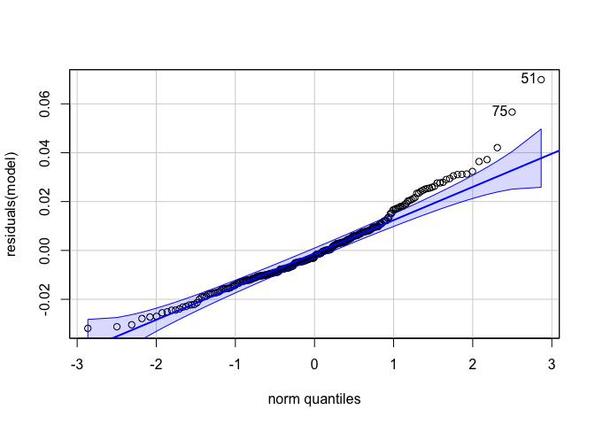
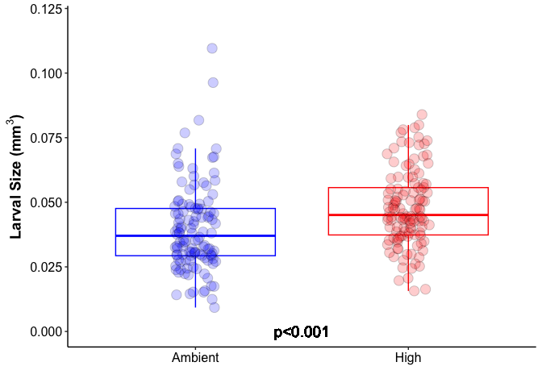

Some code from Ariana
================
AS Huffmyer
2023

``` r
library(tidyverse)
```

    ## ── Attaching core tidyverse packages ──────────────────────── tidyverse 2.0.0 ──
    ## ✔ dplyr     1.1.2     ✔ readr     2.1.4
    ## ✔ forcats   1.0.0     ✔ stringr   1.5.0
    ## ✔ ggplot2   3.4.2     ✔ tibble    3.2.1
    ## ✔ lubridate 1.9.2     ✔ tidyr     1.3.0
    ## ✔ purrr     1.0.1     
    ## ── Conflicts ────────────────────────────────────────── tidyverse_conflicts() ──
    ## ✖ dplyr::filter() masks stats::filter()
    ## ✖ dplyr::lag()    masks stats::lag()
    ## ℹ Use the ]8;;http://conflicted.r-lib.org/conflicted package]8;; to force all conflicts to become errors

``` r
library(car)
```

    ## Loading required package: carData
    ## 
    ## Attaching package: 'car'
    ## 
    ## The following object is masked from 'package:dplyr':
    ## 
    ##     recode
    ## 
    ## The following object is masked from 'package:purrr':
    ## 
    ##     some

## Load some data

Load some data for coral larval size in two temperature treatments.

``` r
data<-read_csv(file="data/11-ashuff-larval-size-data.csv")
```

    ## Rows: 320 Columns: 11
    ## ── Column specification ────────────────────────────────────────────────────────
    ## Delimiter: ","
    ## chr (6): tube.ID, photo.label, initials, timepoint, tank, treatment
    ## dbl (5): date.photographed, rep, length.mm, width.mm, volume.mm3
    ## 
    ## ℹ Use `spec()` to retrieve the full column specification for this data.
    ## ℹ Specify the column types or set `show_col_types = FALSE` to quiet this message.

``` r
data<-data%>%
  select(!volume.mm3)
```

Calculate volume as a prolate spheroid.

``` r
data<-data%>%
  mutate(volume.mm3=((4/3) * pi * (width.mm/2) * (length.mm/2)^2))
```

Look at the data.

``` r
str(data)
```

    ## tibble [320 × 11] (S3: tbl_df/tbl/data.frame)
    ##  $ tube.ID          : chr [1:320] "P1" "P1" "P1" "P1" ...
    ##  $ date.photographed: num [1:320] 20220419 20220419 20220419 20220419 20220419 ...
    ##  $ photo.label      : chr [1:320] "P1-2" "P1-2" "P1-2" "P1-2" ...
    ##  $ rep              : num [1:320] 1 2 3 4 5 6 7 8 9 10 ...
    ##  $ length.mm        : num [1:320] 0.374 0.5 0.457 0.405 0.51 0.432 0.372 0.445 0.351 0.271 ...
    ##  $ width.mm         : num [1:320] 0.466 0.387 0.281 0.313 0.422 0.367 0.308 0.261 0.325 0.245 ...
    ##  $ initials         : chr [1:320] "KMD" "KMD" "KMD" "KMD" ...
    ##  $ timepoint        : chr [1:320] "Baseline" "Baseline" "Baseline" "Baseline" ...
    ##  $ tank             : chr [1:320] "Pool" "Pool" "Pool" "Pool" ...
    ##  $ treatment        : chr [1:320] "Ambient" "Ambient" "Ambient" "Ambient" ...
    ##  $ volume.mm3       : num [1:320] 0.0341 0.0507 0.0307 0.0269 0.0575 ...

``` r
head(data)
```

    ## # A tibble: 6 × 11
    ##   tube.ID date.photographed photo.label   rep length.mm width.mm initials
    ##   <chr>               <dbl> <chr>       <dbl>     <dbl>    <dbl> <chr>   
    ## 1 P1               20220419 P1-2            1     0.374    0.466 KMD     
    ## 2 P1               20220419 P1-2            2     0.5      0.387 KMD     
    ## 3 P1               20220419 P1-2            3     0.457    0.281 KMD     
    ## 4 P1               20220419 P1-2            4     0.405    0.313 KMD     
    ## 5 P1               20220419 P1-2            5     0.51     0.422 KMD     
    ## 6 P1               20220419 P1-2            6     0.432    0.367 KMD     
    ## # ℹ 4 more variables: timepoint <chr>, tank <chr>, treatment <chr>,
    ## #   volume.mm3 <dbl>

## Run some code

Filter data to only the final time point.

``` r
data<-data%>%
  filter(!timepoint=="Baseline")
```

Run anova model to look at treatment differences.

``` r
model<-aov(volume.mm3~treatment, data=data)

summary(model)
```

    ##              Df  Sum Sq  Mean Sq F value   Pr(>F)    
    ## treatment     1 0.00373 0.003733   14.98 0.000141 ***
    ## Residuals   238 0.05933 0.000249                     
    ## ---
    ## Signif. codes:  0 '***' 0.001 '**' 0.01 '*' 0.05 '.' 0.1 ' ' 1

``` r
qqPlot(residuals(model))
```

<!-- -->

    ## [1] 51 75

Plot the data.

``` r
plot<-data %>%
    filter(timepoint=="Sampling")%>%
  
    ggplot(., aes(x = as.factor(treatment), y = volume.mm3)) +
    geom_boxplot(aes(color=treatment), outlier.shape=NA, lwd=0.5) +
    geom_point(aes(fill=treatment), pch = 21, size=4, position = position_jitterdodge(0.2), alpha=0.2) + 
    scale_fill_manual(values=c("blue", "red"))+
    scale_color_manual(values=c("blue", "red"))+
    xlab("") + 
    ylab(expression(bold(paste("Larval Size (mm"^3, ")"))))+
    geom_text(x=1.5, y=0.0, label="p<0.001", color="black", size=5)+
    theme_classic() + 
    ylim(0,0.12)+
    theme(
      legend.position="none",
      axis.title=element_text(face="bold", size=14),
      axis.text=element_text(size=12, color="black"), 
      legend.title=element_text(face="bold", size=14)
      ); plot
```

<!-- -->

## Output some new data

Generate a data frame that outputs descriptive statistics for larval
size in each treatment.

``` r
data %>%
    filter(!timepoint=="Baseline")%>% #keep just the end time point
    group_by(treatment)%>%
    dplyr::summarise(mean=mean(volume.mm3, na.rm=TRUE), 
                     n=length(volume.mm3),
                     sd=sd(volume.mm3, na.rm=TRUE),
                     se=sd/sqrt(n))%>%
    write_csv("output/11-ashuff-output-data.csv")
```
